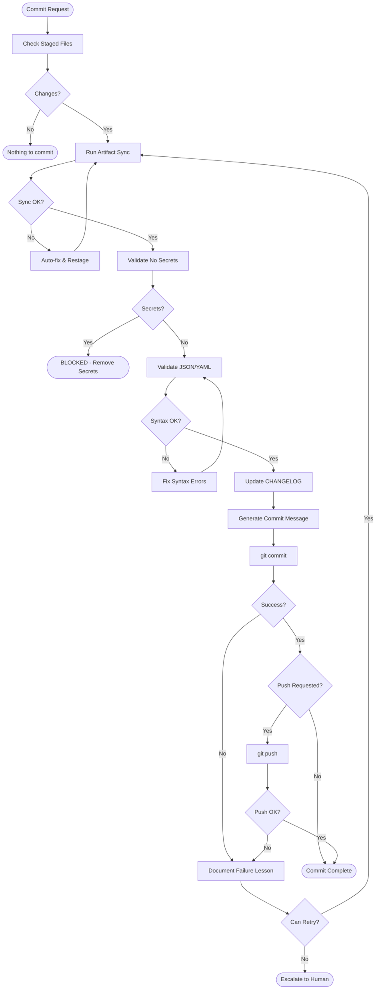

---
agents:
- none
category: chain
description: Safe commit and release workflow with auto-sync, changelog updates, and
  learning from failures
knowledge:
- none
name: committing-releases
related_skills:
- none
templates:
- none
tools:
- none
type: skill
version: 1.0.0
---
# Commit Release

Safe commit and release workflow with auto-sync, changelog updates, and learning from failures

# Commit Release Skill

## Purpose

Execute commits and releases safely, learning from every failure. This skill embodies **A10 (Learning)**: every failure is an opportunity to improve.

## Philosophy

> "A failed commit teaches us more than a successful one - if we pay attention."

Traditional commit workflows block developers with cryptic errors. This skill:
- **Auto-fixes** what can be fixed (artifact sync, formatting)
- **Only blocks** for unfixable issues (secrets, syntax errors)
- **Documents lessons** from each failure to prevent recurrence

## Workflow



## Pre-Commit Checklist

### CRITICAL: Version Bump for Release Commits

When committing a new feature or release (version bump), you MUST:

1. **Update CHANGELOG.md first** - Add a new `## [X.X.X] - YYYY-MM-DD` section (this is the source of truth)
2. **Update factory-updates.json** - Set `factory_version` to match the new version

*Note: The remaining steps (version sync, artifact sync, catalog generation) are now handled **automatically** by the `pre-commit` hook when you commit. You do not need to run these manually unless debugging.*

**CRITICAL ordering when new files were created**: Sync scripts count git-tracked files. If you created new files (e.g., knowledge JSON files), you MUST stage them first:
1. `git add -A` (make new files visible to sync scripts)
2. Run sync/validation scripts
3. `git add -A` again (pick up any files modified by sync scripts)
4. Commit

Before committing, use the **unified pre-commit runner**:

### Unified Pre-Commit Runner (Recommended)
```powershell
# Full sync mode - runs all validations in parallel and auto-fixes
{PYTHON_PATH} {directories.scripts}/git/pre_commit_runner.py --sync

# Check mode - validate only, no modifications
{PYTHON_PATH} {directories.scripts}/git/pre_commit_runner.py --check

# Fast mode - skip slow validation checks
{PYTHON_PATH} {directories.scripts}/git/pre_commit_runner.py --sync --fast

# Full mode - sync + run all tests in parallel
{PYTHON_PATH} {directories.scripts}/git/pre_commit_runner.py --sync --full

# Sequential mode - disable parallel execution
{PYTHON_PATH} {directories.scripts}/git/pre_commit_runner.py --sync --sequential
```

The unified runner executes in **2 parallel execution groups** (optimized for maximum parallelism):

| Group | Scripts (Parallel) | Time |
|-------|-------------------|------|
| 0 | `sync_manifest`, `sync_knowledge`, `validate_yaml`, `dependency_validator` (critical), `sync_artifacts`, `generate_test_catalog`, `changelog_check` | ~1.2s (7 parallel) |
| 1 | `validate_readme`, `update_index` | ~0.5s (2 parallel) |

**Total: ~3-5 seconds** (optimized with fast file-based test counting)

**Workflow steps:**
1. **Cleanup** - Removes temp files (`__pycache__`, `.pytest_cache`, etc.)
2. **JSON Validation** - Validates all JSON syntax (excludes `data/` and `fixtures/`)
3. **Parallel Sync** - Runs 9 scripts across 4 groups in parallel
4. **Auto-Stage** - Stages files modified by sync scripts

### Changelog Helper (Automatic)
```powershell
# Check if changelog needs update (run by pre_commit_runner)
{PYTHON_PATH} {directories.scripts}/docs/changelog_helper.py --check

# Get suggested entries if update needed
{PYTHON_PATH} {directories.scripts}/docs/changelog_helper.py --suggest

# Validate changelog format
{PYTHON_PATH} {directories.scripts}/docs/changelog_helper.py --validate
```

The changelog helper triggers when **3+ significant files** are staged:
- Blueprints (`{directories.blueprints}/`)
- Knowledge files (`{directories.knowledge}/*.json`)
- Templates (`{directories.templates}/`)
- Agents (`{directories.agents}/`)
- Skills (`{directories.skills}/`)

### Legacy Individual Scripts
For debugging or specific tasks:

```powershell
# Artifact sync only
{PYTHON_PATH} {directories.scripts}/validation/sync_artifacts.py --sync

# Secrets check
{PYTHON_PATH} {directories.scripts}/validation/scan_secrets.py --staged
```

## Commit Message Format

Use Conventional Commits:

```
<type>(<scope>): <description>

<body>

<footer>
```

### Types
| Type | When |
|------|------|
| `feat` | New feature |
| `fix` | Bug fix |
| `docs` | Documentation only |
| `style` | Formatting, no code change |
| `refactor` | Code change, no feature/fix |
| `test` | Adding tests |
| `chore` | Maintenance tasks |

### Example
```
feat(workflows): expand workflow system from 1 to 21 workflows

Add 20 new workflows across 8 categories:
- Universal: feature-development, bugfix-resolution, code-review, tdd-cycle, release-management
- Quality: quality-gate, bdd-driven-development, security-audit
- Agile: sprint-planning, sprint-closure, daily-standup, backlog-refinement
- Blockchain: smart-contract-audit
- Trading: trading-strategy-pipeline
- SAP: rap-development, cap-service-development
- AI/ML: multi-agent-orchestration, rag-pipeline-development
- Operations: cicd-pipeline, incident-response

Includes validation tests and documentation updates.
```

## PowerShell Commit Command

For multi-line commit messages on Windows:

```powershell
# Option 1: Multiple -m flags
git commit -m "feat(scope): description" -m "Body paragraph" -m "Footer"

# Option 2: Single quoted string with backtick-n
git commit -m "feat(scope): description`n`nBody paragraph"

# AVOID: Heredoc syntax (Bash only, fails in PowerShell)
```

### Automated Commit Workflow (Recommended)

The Factory uses **pre-commit hooks** to ensure all commits are "safe" by default. When you run `git commit`, the system automatically:
- **Auto-syncs** version strings
- **Auto-syncs** all artifacts
- **Validates** JSON/YAML syntax
- **Runs** linting and type checking

**PREFERRED: Use `git commit` directly** - it triggers the mandatory safety checks.

**FULL VERIFICATION: Use `safe_commit.py`** - use this for major releases to include **smoke tests** and automatic pushing:

```powershell
# safe_commit.py runs the full Robust Commit Workflow (RCW) + Smoke Tests
{PYTHON_PATH} {directories.scripts}/git/safe_commit.py "feat(scope): description" --push
```

**Manual --no-verify (only if you've already run pre-commit):**

```powershell
# ONLY use --no-verify if you've ALREADY run pre-commit:
{PYTHON_PATH} {directories.scripts}/git/pre_commit_runner.py --sync

# Then commit with --no-verify to avoid running twice:
git commit --no-verify -m "feat(scope): description"
```

**WARNING:** Never use `--no-verify` without running pre-commit first. This bypasses all validation and can cause CI failures.

## Changelog Update

Before committing significant changes, update `CHANGELOG.md`:

```markdown

## [Unreleased]

### Added
- New workflow system with 21 workflows across 8 categories

### Changed
- Pre-commit hook now auto-syncs instead of blocking

### Fixed
- PowerShell commit message handling
```

## Learning From Failures (A10)

When a commit fails:

1. **Capture the error** - Save exact error message
2. **Identify root cause** - Why did it fail?
3. **Implement fix** - Resolve the issue
4. **Document lesson** - Add to this skill or create rule
5. **Prevent recurrence** - Update pre-commit hook if applicable

### Known Failure Patterns

| Pattern | Cause | Solution |
|---------|-------|----------|
| Heredoc error | PowerShell doesn't support `<<EOF` | Use multiple `-m` flags |
| Artifact out of sync | Files changed after staging | Run `sync_artifacts.py --sync --fast` |
| Secret detected | API key in file | Remove secret, use env var |
| JSON syntax error | Invalid JSON | Fix syntax before commit |
| JSON BOM error | PowerShell writes UTF-16 BOM | Use `utf-8-sig` encoding in Python |
| Pre-commit timeout | Slow artifact sync | Simplified hook: skip artifact sync |
| `set -e` silent fail | Shell exits on any error | Removed `set -e`, explicit error handling |
| Broken dependency ref | Agent/skill references non-existent artifact | Fix node IDs in `dependency-graph.json` or skill frontmatter |
| Knowledge count mismatch | Sync scripts ran before `git add` with new untracked files | ALWAYS `git add -A` BEFORE running sync scripts - they count git-tracked files only |
| Leftover auto-generated files | Pre-commit sync scripts modify bundles/docs but sync guard missed them | Fixed: sync guard now catches all `docs/*`, `bundles/*`, `README.md`, `knowledge/manifest.json` via prefix matching |

## Stage and Commit Flow

### Recommended: Use safe_commit.py (Enforced Validation)

```powershell
# Single command - ALWAYS runs pre-commit, then commits
{PYTHON_PATH} {directories.scripts}/git/safe_commit.py "feat(scope): description"

# With push
{PYTHON_PATH} {directories.scripts}/git/safe_commit.py "feat(scope): description" --push

# With body text (PowerShell) - Use backtick-n for newlines
{PYTHON_PATH} {directories.scripts}/git/safe_commit.py "feat(scope): description`n`nDetailed body text" --push

# Fast mode (skip slow checks) not supported by current script version
# {PYTHON_PATH} {directories.scripts}/git/safe_commit.py "fix(scope): quick fix" --push

# Dry run (validate without committing)
{PYTHON_PATH} {directories.scripts}/git/safe_commit.py --dry-run "feat(scope): test"
```

**Why safe_commit.py?**
- CANNOT be bypassed - pre-commit always runs first
- Prevents accidental `--no-verify` without validation
- Single command does everything correctly
- Used by shell agents for reliable commits

### Manual Flow (Legacy)

```powershell
# 1. Stage all changes
git add -A

# 2. Commit directly (Safe Commit Integration)
# This will automatically trigger the pre-commit runner for sync and validation
git commit -m "feat(scope): description"

# 3. If changelog warning appears, review suggestions
{PYTHON_PATH} {directories.scripts}/docs/changelog_helper.py --suggest
# Then manually update CHANGELOG.md with curated entries

# 4. Restage if changelog was updated
git add CHANGELOG.md

# 5. Commit with proper message format
git commit -m "feat(scope): description" -m "Detailed body"

# 6. Push if requested
git push origin HEAD
```

## GitHub Integration

Use the `github` MCP server for advanced repository management:

### Pull Request Management
- **Create PR**: Use `create_pull_request` to open a PR for the current branch.
- **Update PR**: Use `update_pull_request` to modify title/body.
- **Merge**: Use `merge_pull_request` when checks pass.


## Integration with Pre-Commit Hook

The Factory's pre-commit hook (`.git/hooks/pre-commit`) now:
- **Auto-syncs** version strings (via `sync-manifest-versions.py`)
- **Auto-syncs** all artifacts instead of blocking
- **Auto-stages ALL generated files** — bundles, docs, index, test catalog, manifest, and README are staged in the same commit via a sync guard that catches every unstaged file matching `docs/*`, `bundles/*`, `README.md`, `CHANGELOG.md`, and `knowledge/manifest.json`
- **Runs artifact-aware validation** — when knowledge, skill, or workflow files are staged, the matching pytest validation suite runs automatically and blocks the commit on failure
- **Checks changelog** and warns if significant changes need documentation
- Only **blocks** for secrets, syntax errors, and validation test failures

Install the hook with:
```powershell
{PYTHON_PATH} {directories.scripts}/git/install_hooks.py
```

This aligns with A10: failures are learning opportunities, not punishment.

## Output

After successful commit:

```
[OK] Pre-commit complete (auto-fixed and staged any sync updates)
[main abc1234] feat(workflows): expand workflow system
 25 files changed, 3000 insertions(+)
```

## Related Skills

| Skill | Use When |
|-------|----------|
| `ci-monitor` | Watch CI after push |
| `pipeline-error-fix` | CI failures after push |
| `operating-environment` | Platform-specific commands, tool path resolution (scope: always) |

## Best Practices

- Always use `safe_commit.py` for commits rather than manual git commands - it enforces pre-commit validation and prevents bypassing checks
- Run pre-commit in `--sync` mode to auto-fix artifact sync issues rather than blocking - auto-fix what can be fixed, only block for unfixable issues
- Update changelog proactively when committing 3+ significant files (blueprints, knowledge, templates, agents, skills) - document changes as you go
- Use conventional commit format consistently (`feat:`, `fix:`, `docs:`, etc.) to enable automated changelog generation and clear history
- Document failure patterns in the skill when encountering new commit failures - each failure is a learning opportunity (A10)
- Never use `--no-verify` without running pre-commit first - bypassing validation causes CI failures and technical debt

## Axiom Alignment

| Axiom | Application |
|-------|-------------|
| **A10 (Learning)** | Every failure teaches us something |
| A1 (Verifiability) | Commit messages explain changes |
| A3 (Transparency) | Clear changelog entries |
| A5 (Consistency) | Conventional commit format |

## When to Use
This skill should be used when strict adherence to the defined process is required.

## Prerequisites
- Basic understanding of the agent factory context.
- Access to the necessary tools and resources.

## Process
1. Review the task requirements.
2. Apply the skill's methodology.
3. Validate the output against the defined criteria.
