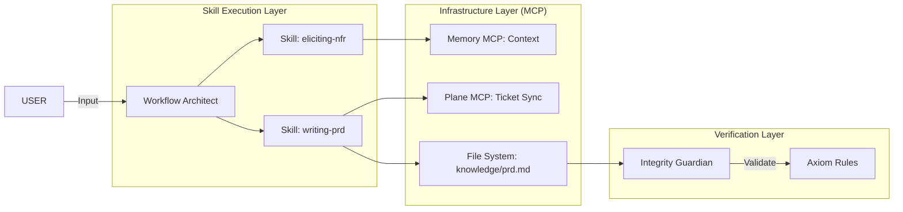
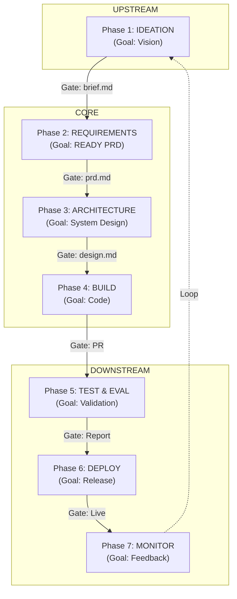

# Antigravity SDLC: Architecture Diagrams

## 1. Agent-Skill-MCP Interaction Matrix
This diagram illustrates how a typical SDLC phase (Phase 2: Requirements) orchestrates across the factory's infrastructure.

## 2. The 7-Phase Linear Progression
Each phase acts as a transformation function, passing validated artifacts forward.

## 3. High-Fidelity Infographic

