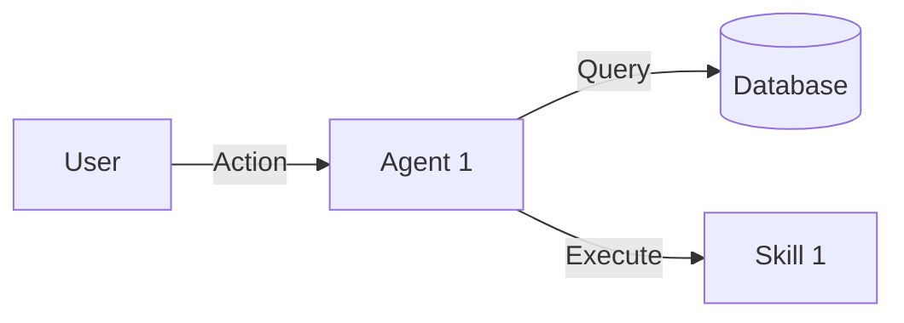

# AI System Design: [Feature Name]

## 1. Architectural Overview
- **Pattern**: [e.g., Microservices, Event-Driven, Multi-Agent]
- **Storage**: [Database schema or RAG index design]
- **API Strategy**: [REST / GraphQL / MCP]

## 2. Component Design
- **Agent Roles**: [Which agents handle which logic?]
- **Service Interfaces**: [Input/Output contracts]
- **Data Flow Diagram**:


## 3. API Contracts (Draft)
```yaml
endpoint: /v1/example
method: POST
request:
  field1: string
response:
  status: ok
```

## 4. Architectural Decision Records (ADRs)
- **ADR-001**: [Decision Title]
  - **Context**: [Why?]
  - **Decision**: [What?]
  - **Consequences**: [Impact]

## 5. Phase Gate Checklist
- [ ] System architecture diagrammed
- [ ] API contracts specified
- [ ] ADRs documented for major decisions
- [ ] Knowledge Graph updated with design pointers
- [ ] Human Sign-off received
